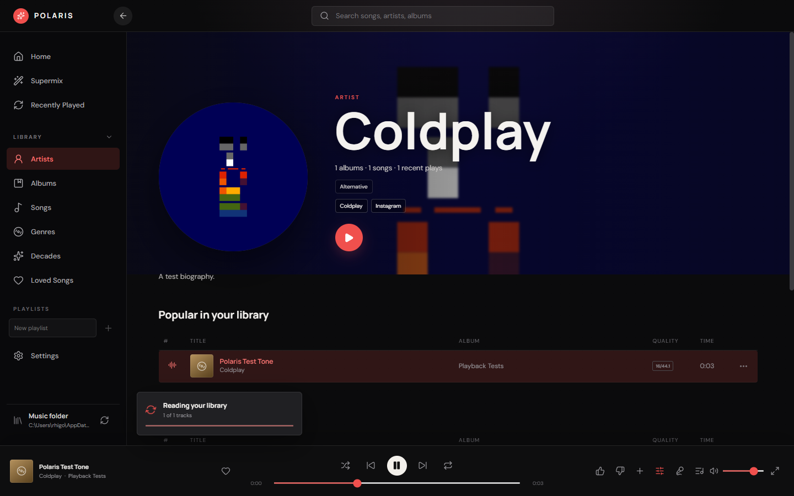
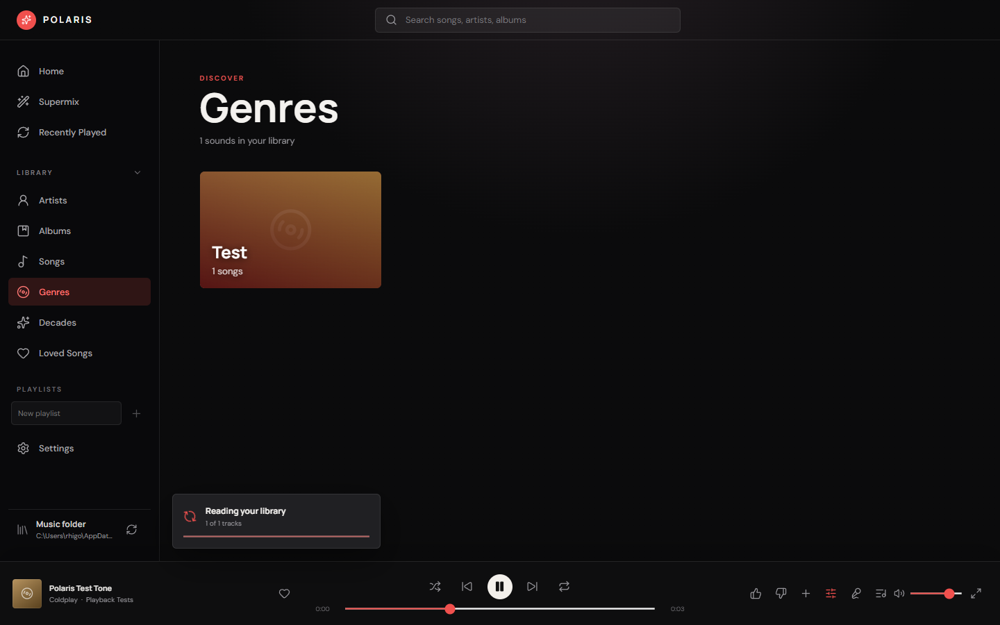
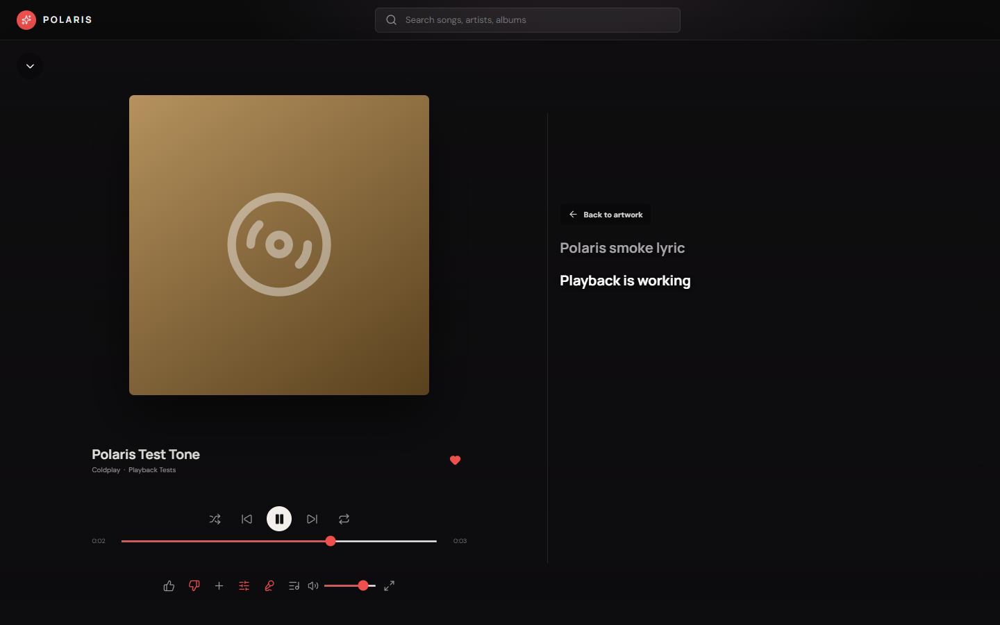
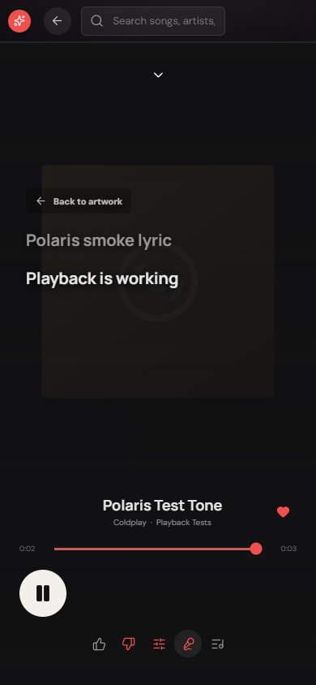

# Polaris Audio

**A fast, private Windows music player for large local and NAS libraries.**

Polaris plays your own collection directly from disk. It combines a responsive library, immersive playback, synchronized lyrics, rich artist pages, playlists, and a preference-aware Supermix without uploading your audio.



## Highlights

- **Built for large collections** - tested with 20,000 tracks, bounded rendering, cached metadata, and concurrent scanning.
- **Incremental NAS updates** - unchanged files reuse indexed tags, while file and `.lrc` changes appear automatically.
- **Local-first playback** - FLAC, MP3, AAC/ALAC, OGG, Opus, WAV, WMA, and APE support with byte-range streaming.
- **Library discovery** - browse artists, albums, songs, genres, decades, recent plays, and loved songs.
- **Supermix** - a regenerating mix shaped by listening history, favorites, thumbs-up, thumbs-down, artists, and genres.
- **Persistent playlists** - create, rename, reorder, remove, and drag tracks into playlists.
- **Immersive player** - desktop and mobile layouts with artwork, lyrics, queue, visualizer, shuffle, repeat-all, and repeat-one.
- **Lyrics fallback** - local `.lrc`, embedded lyrics, then cached LRCLIB results.
- **Rich artist context** - biography and imagery from TheAudioDB, links from MusicBrainz, and ListenBrainz popularity intersected strictly with tracks you own.

## Explore Your Library

Genre and decade views are generated from your tags. Every tile opens a real filtered track list, and the Library navigation can collapse when you want more room.



## Focused Playback

The expanded player keeps transport, feedback, playlist actions, lyrics, queue, and visualizer controls close without hiding the music. Dynamic artwork rendering avoids expensive full-screen blur effects, and lyric lookup uses a binary search as playback advances.



The same experience adapts to narrow screens while preserving the draggable Windows title bar and readable lyrics.



## Privacy

Your audio stays on your computer or NAS. Polaris stores its library index, settings, history, playlists, feedback, lyric cache, and extracted artwork in Electron's per-user application data directory.

Online requests contain only the metadata needed for the selected feature:

| Service | Used for |
| --- | --- |
| [LRCLIB](https://lrclib.net/) | Lyrics when local and embedded lyrics are unavailable |
| [TheAudioDB](https://www.theaudiodb.com/) | Artist biographies and imagery |
| [MusicBrainz](https://musicbrainz.org/) | Canonical artist identity and public links |
| [ListenBrainz](https://listenbrainz.org/) | Global recording rank, filtered to local tracks |
| Wikimedia | Artist image fallback |

Online results and misses are cached. MusicBrainz requests are serialized and rate-limited with a descriptive user agent.

## Getting Started

1. Download or build `Polaris-1.0.0-Portable.exe`.
2. Open Polaris and select **Add music folder**.
3. Choose a local folder, mapped network drive, or UNC share.
4. Leave Polaris open for the initial metadata scan. Later refreshes process only changed files.

For the best browsing experience, keep artist, album, genre, year, disc, and track tags populated. Place synchronized lyrics beside a song using the same filename and an `.lrc` extension.

## Development

Requirements: Windows, Node.js 22 or later, and npm.

```powershell
npm install
npm run dev
```

Useful checks:

```powershell
npm run lint
npm run build
npm run test:smoke
npm run test:performance
```

The smoke suite launches real Electron and exercises streaming, playback, lyrics, discovery, artist APIs, playlists, feedback, settings, and desktop/mobile player layouts. The performance suite measures Songs and search with a synthetic 20,000-track library.

Build the portable Windows application:

```powershell
npm run dist
```

The configured builder writes `Polaris-1.0.0-Portable.exe` to the local release output directory.

## Stack

Electron 44, React 19, TypeScript 6, Vite 8, `music-metadata`, Lucide, and Playwright.

## License

No license has been selected yet. All rights are reserved by the repository owner.
